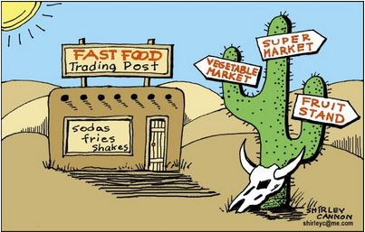
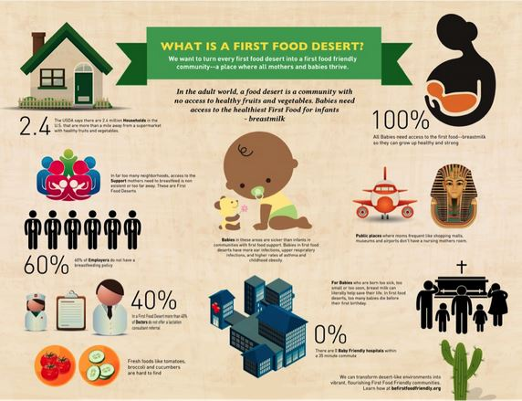
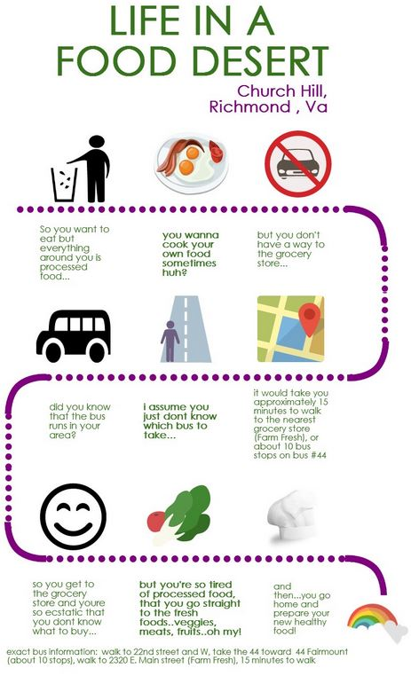

# Digital Geographies: Food Deserts In America
Our complete project can be found at https://swierj.github.io/food_deserts_america/
## Idea, significance, impacts  (delete title later)

A “food desert” generally refers to an area where the population has limited access to fresh and healthy food. A common misconception regarding these food deserts is defining this term as a lack of food all together and believing such only occurs in highly impoverished locations. On the contrary, a food desert can happen in even the most metropolitan of areas. A modern example of a food desert lies in cities where fast food locations are the main or only source of food and where healthy food is either too expensive or non-existent in certain communities. In this project, we want to demonstrate the highest probable locations and spatial distributions of the food deserts in the U.S. based on the multifactorial circumstances that typically lead to food deserts. Such factors can include lack of transportation access, the prevalence of low annual income households, average cost of common food items, and more. 
 
This depiction of food deserts is important because doing so provides an area of focus for groups who wish to improve lack of access to healthy foods and are looking to ameliorate the burden of a lack of nutrition flowing into in-need communities. On a broader scale, calling attention to this lack of a basic right encourages the growth of various communities and will benefit our country as a whole. On the other hand, when constructing projects where undesirable aspects are highlighted, it is also important to recognize how improper representation and disregardful language can lead to damage and social harm. While our project hopes to highlight communities in need, we must also be sure to make clear our intent is to not negatively target or attack the neighborhoods we are visualizing. One important step to accomplishing this is to spend an appropriate amount of time considering the consequences of our representations rather than mindlessly and biasly commenting on the regions we are analyzing.  
 
 
## Primary functions and data sources

The Main function of our map is to present counties that face higher levels of food deserts. We want to be able to compare rural and urban areas on their food ability status and filter counties based on distance to housing markets. Our map will have the ability to filter these values through many tools on a sidebar such as a slider that changes the mile distance between housing and supermarkets, drop down menus for different themes, and radio buttons that can select either urban, rural, or both areas to be focused on the map.

USDA ERS (CSV File): This Dataset maps food access in rural and urban areas by supermarket distance from housing within census tracts. The data is organized conveniently so grabbing values by county is simple.

## Target audience

Anyone who wants to learn more about food deserts is welcome to view our map. We want to create our map to be understood by the average person who may be affected by food deserts. Our main purpose is to provide a tool that can be used to improve living conditions for residents, we would like the following groups to view our map:
Underprivileged/vulnerable residents looking for stable areas with a safe food source.
Local Government officials who can focus on areas lacking in a stable food source.
 
 
## Multimedia

Videos:
https://youtu.be/kQeorPkPLmU
https://youtu.be/jicYbi-8ZNU
https://youtu.be/PdRkqRTIj7I
 
Articles:
https://www.aecf.org/blog/exploring-americas-food-deserts
https://www.brookings.edu/research/beyond-food-deserts-america-needs-a-new-approach-to-mapping-food-insecurity/
 
 

 
## Project format
 
Our project will follow option two: Smart dashboard.  The maps will be based on the Mercator Projection (4328) with zoom levels of around 4 to 20 and centered around (-100.899846, 38.245060).  The basemap we will use is mapbox://styles/mapbox/light-v10.  We will use a choropleth to visualize what percent of the population each state has in a food desert area (https://www.ers.usda.gov/data-products/food-access-research-atlas/download-the-data/).  We will use proportional symbols to visualize the CPI in each area (https://www.ers.usda.gov/data-products/food-price-outlook/).  We will also use vector data from the US Census tract to create boundaries from the polygon shape information.  Some of the proposed interactive functions will be clicking to look at an individual state, switching from different maps, and looking at areas with food deserts in high or low income areas only.  We will have an options menu on the left side of the dashboard and have the map to view on the right ride of the board.  Users can hover over areas of the map to get more information and use the buttons in the options menu to show different data they want.  The coordinated charts will be bar charts to help visualize how each state compares to the others (i.e. percentage of population in food desert areas and the CPI)  and to help create the bar chart we will be using C3.js.
